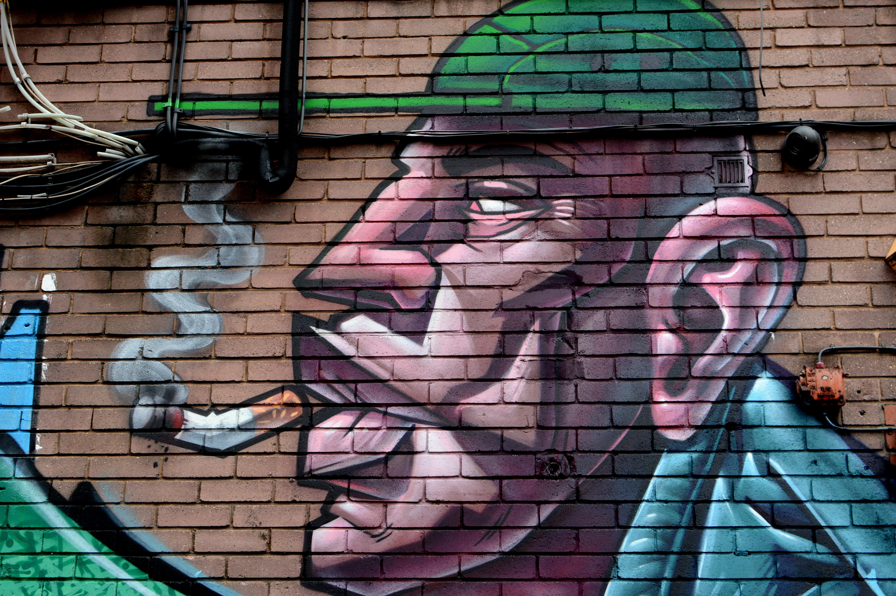
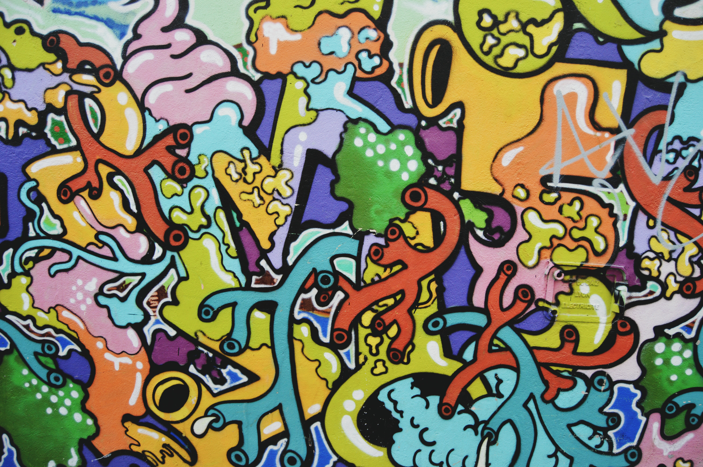

Graffiti has transformed itself from a commonly known form of vandalism to a professional art form. Works of graffiti often allow people to express feelings and emotions as well as leave an impression on society. Not only can graffiti be used as an emotional outlet but it's also a way for people to create awareness and display different points of view. This way of communicating through artwork gives the artist a voice and gets people of the community thinking about different topics and opinions.
## Origin

The word graffiti was derived from the Italian word "graffio" or "scratch". Graffiti markings have also been found in ancient ruins dating back to the 16th century. In the 20th century, graffiti was associated with gangs in order to identify, claim territory or memorialize a member. Tagging also became a popular method of graffiti, placed in strategic areas to attract attention from the community. More about the origin of graffiti can be found [here](https://www.britannica.com/art/graffiti-art).

## More Images

